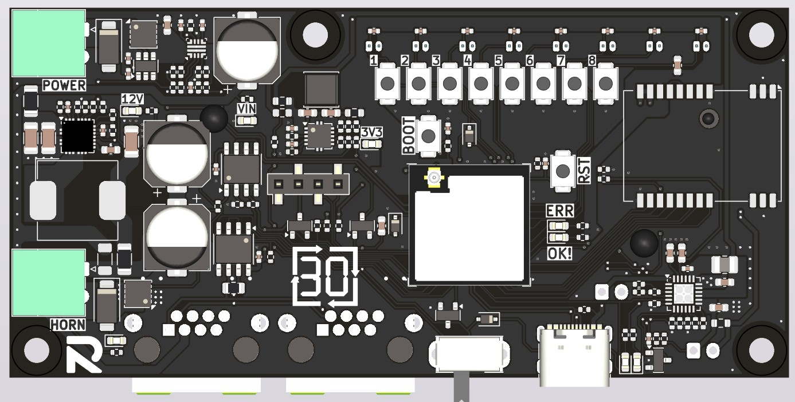
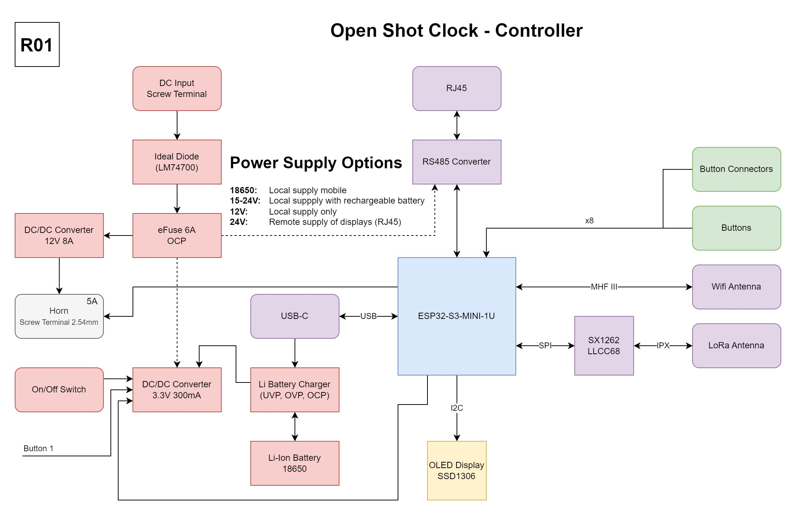

# Open Shot Clock Controller
This is the new hardware platform to build Open Shot Clock Controllers.
The functionality of all boards has been integrated into one custom PCBA. Additional safety measures for overcurrent and reverse polarity protection have been added. Power supply is possible with a single 18650 rechargeable battery or 15-24V DC power supply.
ESP32-S3-MINI is used as core with a low cost LLCC68 LoRa module.

---
## Revision 01 (Zero Series | 2025)
Additionally to the corrections of known issues, the following functions have been added:
* Added a new wide range DC/DC for use with battery or 15-24V PSU
* Switch on by pressing button 1, plugging in USB or by switch
* Added SMD push buttons for button channels 6-8
* Added measurement of battery voltage
* Added optional JST connectors for battery switch and 5V power
* Added ideal diode as reverse polarity protection
* Adjusted eFuse configuration

### Know Issues
* Power on mechanism is not working properly, due to missing pull-down resistor on Q403.
* Voltage divider for battery voltage measurement leads to ~0.5mA leakage current into ESP32 pin.

### Patches
* Solder 10k 0603 resistor directly between pins 1-2 of Q403.
* Remove R448 or use J401 with additional power switch with R435 removed.
---
## Revision 00 (Prototype | 2024)
### Known Issues
* No isolation of main power input to RJ45 connectors. This could lead to excessive currents when two separately powered displays are connected using RJ45.
* Cheap and powerfull horns can trigger 9A OCP of DC-DC regulator.
* PG output of TPS259474x vmax is 6.5V, directly connected to VIN of SIC438BED.
* Only one set of D+/D- pins of USB-C is connected. (only works in one direction)
* Horn MOSFET switch can burn due to low gate voltage from ESP32.

### Patches
* None

### Improvements for next Release
* SIC438BED PG is not connected. Could be used as short detection on 12V rail.
* Add indication LEDs for horn output.
