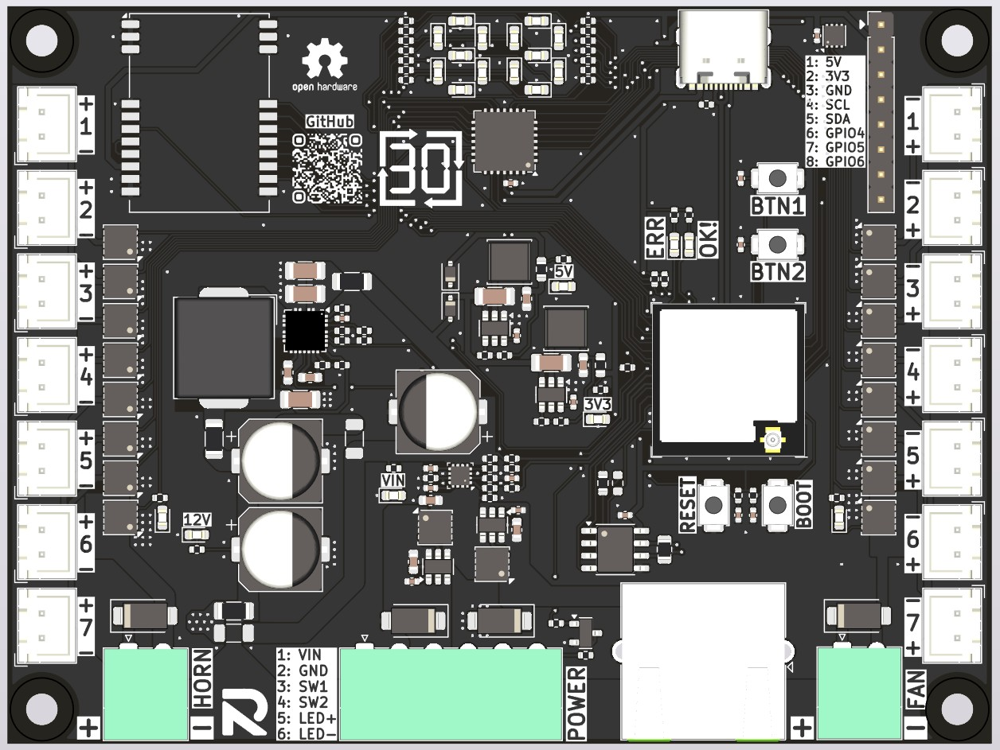
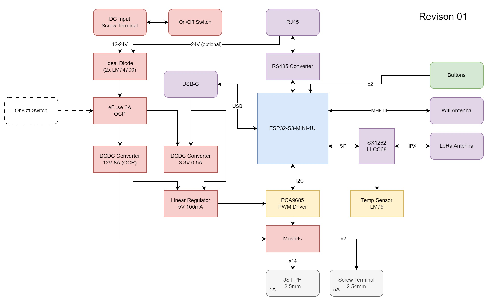

# Open Shotlock Display
This is the new hardware platform to build Open Shot Clock Displays.
The functionality of all tinker boards has been integrated into one custom PCBA. Additional safety measures for overcurrent and reverse polarity protection have been added. ESP32-S3-MINI is used as core with a low cost LLCC68 LoRa module.
For development purposes, 7-Segment indication LEDs were also added.

## Revision 00 (Zero Series | 2025)

### Known Issues
* None

### Patches
* None

## Revision 00 (Prototypes | 2024)
### Known Issues
* No isolation of main power input to RJ45 connectors. This could lead to excessive currents when two separately powered displays are connected using RJ45.
* 7-Segment built from SMD LEDs has wrong layout (left/right part mirrored)
* Wrong footprint for RJ45 connector
* Cheap and powerfull horns can trigger 9A OCP of DC-DC regulator.
* AP2210 regulator is connected to VCC. When powering with 24V this could damage the regulator.
* PG output of TPS259474x vmax is 6.5V, directly connected to VIN of SIC438BED.
* Only one set of D+/D- pins of USB-C is connected. (only works in one direction)

### Patches
* None

### Improvements for next Release
* SIC438BED PG is not connected. Could be used as short detection on 12V rail.
* Mark polarity of LED connectors on PCB.
* Add indication LEDs for fan and horn outputs.